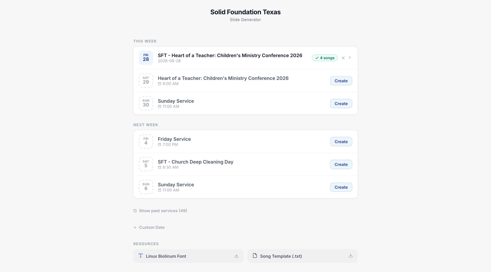

# txt2pro

**Turn plain-text bilingual worship lyrics into ProPresenter 7 presentations.**

Drop in the `.txt` / `.rtf` files your translation team already writes, check the
slides in a browser, publish a versioned `.proBundle`, and let a small agent on
the ProPresenter Mac pull it down automatically before the service. No more
building bilingual slides by hand every week.

txt2pro was built specifically for [Solid Foundation Texas](https://github.com/sftchurch),
a Russian/English church — the slide look, fonts, and calendar defaults are
ours. Nothing in it is language-specific, though: any "original + translation"
pair works. You're welcome to **fork it** and adapt it to your church, and to
**open an issue or pull request** if you have an improvement to suggest.

<p align="center">
  
</p>

- [How it works](#how-it-works)
- [Lyric file format](#lyric-file-format)
- [Ways to use it](#ways-to-use-it)
  - [Convert one file from the command line](#1-convert-one-file-from-the-command-line)
  - [Use the converter as a library](#2-use-the-converter-as-a-library)
  - [Run the web app (self-host on Cloudflare)](#3-run-the-web-app-self-host-on-cloudflare)
  - [Auto-sync bundles to the ProPresenter Mac](#4-auto-sync-bundles-to-the-propresenter-mac)
- [Slide templates](#slide-templates)
- [Repository layout](#repository-layout)
- [Development](#development)
- [API](#api)
- [Limitations](#limitations)
- [Credits](#credits)
- [Contributing](#contributing)
- [License](#license)

## How it works

```
 translation team            volunteer (browser)              church Mac
 ────────────────            ───────────────────              ──────────
 song1.txt  ─┐                                               txt2pro-sync
 song2.rtf  ─┼─▶ drop files ─▶ preview / edit ─▶ publish ─▶ (launchd agent)
 song3.txt  ─┘      │                              │              │
                    ▼                              ▼              ▼
              parser + .pro generator     Cloudflare Worker   ~/Desktop/Today's Service/
              (runs in the browser        D1 = service index      current.proBundle
               and in the Worker)         R2 = bundles/versions        │
                                                                        ▼
                                                                  ProPresenter
                                                                  (File → Import)
```

1. **Parse** — each lyric file becomes one song; blank-line-separated blocks are
   paired as *original* + *translation*, one pair per slide.
2. **Generate** — each song becomes a ProPresenter 7 `.pro` file (protobuf +
   RTF text), styled by a [template](#slide-templates). A whole service is
   zipped into a `.proBundle`.
3. **Publish** — the Worker stores every publish as an immutable version
   (v1, v2, …) so a lyric fix is a re-publish, never an overwrite.
4. **Sync** — the Mac agent polls for new checksums, downloads bundles, and keeps
   a one-file "Today's Service" folder on the Desktop for the operator.

Steps 1–2 also run standalone from the command line with no server at all.

## Lyric file format

This is the whole format. A file is one song. Blocks are separated by blank
lines and alternate **original → translation → original → translation …**
Each pair becomes one slide.

```
Свет над рекой, тихий рассвет
Новый день — и с нами Ты

Light on the river, a quiet dawn
A new day — and You are with us

[Chorus]
Мы поём, мы поём
Всем сердцем славим Тебя

We sing, we sing
With all our heart we praise You
```

| Rule | Detail |
|------|--------|
| **Song title** | Taken from the filename: `amazing_grace.txt` → *Amazing Grace*. |
| **Line breaks** | Kept exactly as written. 1–3 lines per block is the sweet spot; the parser warns above 3. |
| **Section labels** | Optional. Put `[Verse 1]`, `[Chorus]`, `[Bridge]`, `[Pre-Chorus]`, `[Tag]`… on the first line of a block. Russian labels (`[Куплет]`, `[Припев]`, `[Предприпев]`, `[Бридж]`) are understood too. Labels become ProPresenter cue names and (in the Youth template) colored cue groups. Unlabeled slides are named *Slide 1*, *Slide 2*, … |
| **Odd block at the end** | Treated as original-only, with a warning. |
| **File types** | `.txt` (UTF-8) or `.rtf` (formatting is stripped — Word exports are fine). |

The web app has the same guide built in ("How should I format my files?") plus
a downloadable sample file.

## Ways to use it

### 1. Convert one file from the command line

Requires Node 20+. No Cloudflare account, no server.

```sh
git clone https://github.com/sftchurch/txt2pro.git
cd txt2pro
npm install
npx tsx scripts/convert.ts path/to/song.txt     # writes ./Song.pro
```

Open the `.pro` in ProPresenter (File → Import). The script prints the parsed
slides and any warnings first, so it doubles as a format checker.

Handy inspection tools for existing ProPresenter files:

```sh
npx tsx scripts/inspect-pro.ts some.pro   # decode a .pro to readable JSON
npx tsx scripts/dump-rtf.ts some.pro      # dump the raw RTF of each text box
```

### 2. Use the converter as a library

The parser and generator in `src/lib/` have no browser or Cloudflare
dependencies — they are plain TypeScript on top of `protobufjs` and `fflate`.

```ts
import { parseSongFile }      from './src/lib/parser.js';
import { generatePresentation } from './src/lib/generator.js';
import { createProBundle }    from './src/lib/bundle.js';
import { TEMPLATES }          from './src/lib/templates.js';

const song = parseSongFile(text, 'amazing_grace.txt');   // → ParsedSong (title, slides, warnings)
const pro  = generatePresentation([song], TEMPLATES.main); // → Uint8Array (.pro)

const bundle = createProBundle([
  { name: 'Amazing Grace.pro', data: pro },
  // ...one entry per song
]);                                                        // → Uint8Array (.proBundle)
```

### 3. Run the web app (self-host on Cloudflare)

The web app is what volunteers use: drag-and-drop upload, slide thumbnails, a
fullscreen editor (undo/redo, autosaved drafts), per-service and per-song
templates, version history with downloads, and optional "suggested services"
from a church calendar ICS feed.

| Home — upcoming services suggested from the calendar | Fullscreen slide editor |
|---|---|
|  |  |

It is two deployments on the Cloudflare free tier:

| Piece | Runs on | Talks to |
|-------|---------|----------|
| `web/` — React SPA | Cloudflare **Pages** | the Worker at `VITE_API_URL` |
| `worker/` — API | Cloudflare **Worker** | **D1** (SQLite) + **R2** (object storage) |

**One-time setup**

```sh
# 0. Log in
npx wrangler login

# 1. Create storage
npx wrangler d1 create txt2pro          # note the database_id it prints
npx wrangler r2 bucket create txt2pro

# 2. Point the Worker at YOUR resources
#    edit worker/wrangler.jsonc: account_id, d1_databases[0].database_id,
#    r2_buckets[0].bucket_name, and optionally vars.ICAL_URL (see below)

# 3. Create the tables and deploy the API
cd worker && npm install
npm run db:init -- --remote             # applies schema.sql to the D1 database
npm run deploy                          # prints https://txt2pro.<your-subdomain>.workers.dev

# 4. Point the frontend at the API and deploy it
cd ../web && npm install
echo 'VITE_API_URL=https://txt2pro.<your-subdomain>.workers.dev' > .env.production
npm run build
npx wrangler pages deploy dist --project-name=txt2pro
```

After that, a redeploy is just `npm run deploy` (worker) or
`npm run build && npx wrangler pages deploy dist --project-name=txt2pro` (web).

**Calendar feed (optional).** Set `ICAL_URL` to any public ICS feed and the
home screen will suggest upcoming services from it. If your feed URL embeds a
private token, store it as a secret instead of a `var`:
`npx wrangler secret put ICAL_URL`.

**Access control.** The API currently has **no authentication** — anyone who
knows the Worker URL can publish or delete services. Put both the Pages site and
the Worker behind [Cloudflare Access](https://developers.cloudflare.com/cloudflare-one/policies/access/)
(free for small teams) or add your own token check before exposing it.

### 4. Auto-sync bundles to the ProPresenter Mac

`sync/` is a small Rust agent that runs as a macOS LaunchAgent: at every login
and every 60 s it asks the API for the latest checksums, downloads changed
bundles to `~/Documents/txt2pro/<Service>/`, keeps exactly one bundle in
`~/Desktop/Today's Service/`, posts a notification, and can open new bundles in
ProPresenter for one-click import. It ships with a "Sync now" Desktop shortcut
and a SwiftBar menu-bar plugin.

```sh
cd sync
TXT2PRO_API=https://txt2pro.<your-subdomain>.workers.dev ./install.sh
```

Full options, logs, and uninstall: [`sync/README.md`](sync/README.md).

## Slide templates

Templates are defined once in [`src/lib/templates.ts`](src/lib/templates.ts)
and used by both the generator and the browser previews, so what you see in the
editor is what ProPresenter renders (fonts are self-hosted for measurement
parity). A service has a default template and any song can override it.

| Template | Look | Font on the ProPresenter Mac |
|----------|------|------------------------------|
| **Main** (default) | 1920×1080, two boxes: original on top (white, 120 pt) and translation below (gold, 100 pt). Text clips rather than shrinks, exactly like the exported cue. | [Linux Biolinum](https://libertine-fonts.org/) |
| **Youth** | One full-screen box, PT Serif 100 pt white on black, middle-aligned, original and translation stacked; section labels become colored cue groups (verse / chorus / bridge …). | [PT Serif](https://fonts.google.com/specimen/PT+Serif) |

Both templates are simply what our church projects with — Linux Biolinum is
Solid Foundation Texas's house font, not a requirement of the tool. To use a
different font: change `fontName` / `fontFamily` for the template
(`src/lib/template.ts` holds the Main style, `src/lib/templates.ts` the rest),
add a matching `@font-face` in `web/index.html` with the `.woff2` in
`web/public/fonts/` so previews measure with the same font, and install the
font on the Mac that runs ProPresenter — otherwise ProPresenter substitutes
and line wrapping will differ from the preview. Adding a whole new template is
adding an entry to `TEMPLATES` — no other code changes.

## Repository layout

| Path | What it is |
|------|------------|
| `src/lib/` | Shared core: `parser.ts`, `generator.ts` (protobuf), `rtf-build.ts` / `rtf-strip.ts`, `bundle.ts` (zip), `templates.ts`, `proto-static.js` (generated ProPresenter bindings, committed). Imported by the web app as `@shared/*`. |
| `scripts/` | CLI tools: `convert.ts`, `inspect-pro.ts`, `dump-rtf.ts`. |
| `web/` | Vite + React 19 single-page app → Cloudflare Pages. |
| `worker/` | Cloudflare Worker API, `schema.sql`, D1 `migrations/`. |
| `sync/` | Rust LaunchAgent for the ProPresenter Mac + SwiftBar plugin. |
| `tests/` | Parser, end-to-end, and template regression tests (`npm test`). |
| `docs/` | Deployment/operations notes for the Solid Foundation Texas instance. |
| `txt2pro-plan.md` | Original design notes (versioning model, storage layout, UX). |

## Development

```sh
npm install && npm test                     # core library tests

cd web    && npm install && npm run dev     # http://localhost:5173
cd worker && npm install && npm run dev     # http://localhost:8787 (web/.env.development points here)
```

`worker/wrangler.jsonc` is checked in with the original church's resource IDs;
`wrangler dev` uses local D1/R2 emulation so you can develop without changing
it, but you must edit it before deploying (see [self-hosting](#3-run-the-web-app-self-host-on-cloudflare)).

**Regenerating the protobuf bindings** (only needed when targeting a new
ProPresenter release): drop the `.proto` files from
[ProPresenter7-Proto](https://github.com/greyshirtguy/ProPresenter7-Proto) into
`proto/Proto 19beta/` and run `npm run proto:build`. The generated
`src/lib/proto-static.js` is committed so normal development never needs this.

## API

All routes are JSON unless noted. Storage layout in R2 is
`services/{id}/v{n}/{service.proBundle, lyrics.json, songs/*, pro/*.pro}`.

| Method | Route | Purpose |
|--------|-------|---------|
| `GET`  | `/api/services` | List services with latest version + checksum (what the sync agent polls). |
| `POST` | `/api/services/new` | Create an empty service (`title`, `date`, `template`). |
| `POST` | `/api/services` | Publish: parse the uploaded songs, generate `.pro` files, store a new version. |
| `GET`  | `/api/services/:id` | Service detail with version history and songs. |
| `DELETE` | `/api/services/:id` | Delete a service and all its versions. |
| `GET`  | `/api/services/:id/latest/download` | Latest `.proBundle` (binary). |
| `GET`  | `/api/services/:id/v/:version/download` | A specific version's `.proBundle`. |
| `GET`  | `/api/services/:id/v/:version/songs/:index/pro` | One song's `.pro` from that version. |
| `GET`  | `/api/services/:id/v/:version/lyrics` | The parsed lyrics (`lyrics.json`) of that version. |
| `GET`  | `/api/calendar` | Upcoming events parsed from `ICAL_URL`. |
| `GET`  | `/api/sync/check` | Lightweight change check used by the sync agent. |

## Limitations

- **ProPresenter has no import API.** The agent gets the bundle onto the Mac
  (and can open it), but dragging it into the Sunday playlist is still a click
  in ProPresenter.
- Vertical fit in the preview is close but not exact: the editor uses
  `line-height: 1.3` while ProPresenter uses CoreText's natural leading. The
  editor shows a red edge when a box overflows; borderline cases can differ.
- Downloads always serve the last *published* version — unpublished editor
  edits live only in that browser's draft.
- Files are read as UTF-8. Save legacy Windows-1251 text files as UTF-8 first.

## Credits

- [ProPresenter7-Proto](https://github.com/greyshirtguy/ProPresenter7-Proto) —
  reverse-engineered ProPresenter 7 protobuf definitions that make the `.pro`
  output possible.
- [Linux Libertine / Biolinum](https://libertine-fonts.org/)
  and [PT Serif](https://fonts.google.com/specimen/PT+Serif) — both under the
  SIL Open Font License, bundled in `web/public/fonts/` for preview parity.
- Runs on [Cloudflare](https://www.cloudflare.com/) Pages, Workers, D1 and R2.

## Contributing

This is a small volunteer-maintained project built for one church's workflow,
so expect some Solid Foundation Texas-specific defaults. Forks are welcome
(that's what the MIT license is for), and so are issues and pull requests —
bug reports, lyric-format edge cases, ProPresenter compatibility findings,
or ideas that would help other bilingual churches.

## License

[MIT](LICENSE)
